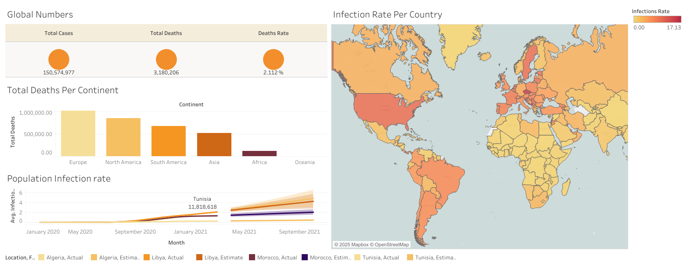

# 📊 COVID-19 Analysis Dashboard  

## 📝 Overview  
This project presents a **Tableau-based dashboard** that visualizes key COVID-19 statistics derived from a publicly available dataset from **[Our World in Data](https://ourworldindata.org/covid-deaths)**.

## 🔍 Data Workflow  
1️⃣ **Exploration in SQL Server** – Initial analysis of the dataset using structured queries.  
2️⃣ **Data Preparation** – Created **four SQL views** and exported them to **Microsoft Excel** for further cleaning.  
3️⃣ **Dashboard Creation in Tableau** – Uploaded the cleaned data to **Tableau** to design interactive visualizations.  

## 📈 Dashboard Insights  
The **COVID-19 Analysis Dashboard** consists of four main sections:  
- **Global Numbers** – Displays **total cases, total deaths, and death rate** worldwide.  
- **Total Deaths Per Continent** – Summarizes **COVID-related deaths per continent**.  
- **Infection Rate Per Country** – A **world map** depicting the infection rate per country.  
- **Population Infection Rate** – Computes the **average infection rate** per country and includes **forecasting** based on historical trends.  

🔗 **Dashboard Link:** [COVID-19 Analysis Dashboard](https://public.tableau.com/app/profile/mohamed.ali.walha/viz/COVIDAnalysisDashboard_17462127023550/Dashboard)  

## 📷 Dashboard Screenshot  
  

## 🔢 SQL Queries  
Below are the SQL queries used to extract relevant data:

```sql
/* Queries Used for Tableau Project */

/* 1. Global Case & Death Rate */
SELECT SUM(NEW_CASES) AS TOTAL_CASES, 
       SUM(CAST(NEW_DEATHS AS INT)) AS TOTAL_DEATHS, 
       SUM(CAST(NEW_DEATHS AS INT)) / SUM(NEW_CASES) * 100 AS "DEATHS_RATE"
FROM COVID_ANALYTICS_DB..COVIDDEATHS
WHERE CONTINENT IS NOT NULL 
ORDER BY 1,2;

/* 2. Total Deaths Per Location */
SELECT LOCATION, SUM(CAST(NEW_DEATHS AS INT)) AS "TOTAL_DEATHS_COUNT"
FROM COVID_ANALYTICS_DB..COVIDDEATHS
WHERE CONTINENT IS NULL 
AND LOCATION NOT IN ('WORLD', 'EUROPEAN UNION', 'INTERNATIONAL')
GROUP BY LOCATION
ORDER BY "TOTAL_DEATHS_COUNT" DESC;

/* 3. Infection Rate Per Country */
SELECT LOCATION, POPULATION, 
       MAX(TOTAL_CASES) AS HIGHEST_INFECTIONS_COUNT,  
       MAX((TOTAL_CASES / POPULATION)) * 100 AS "INFECTIONS_RATE"
FROM COVID_ANALYTICS_DB..COVIDDEATHS
GROUP BY LOCATION, POPULATION
ORDER BY "INFECTIONS_RATE" DESC;

/* 4. Population Infection Rate with Forecast */
SELECT LOCATION, POPULATION, DATE, 
       MAX(TOTAL_CASES) AS HIGHEST_INFECTIONS_COUNT,  
       MAX((TOTAL_CASES / POPULATION)) * 100 AS "INFECTIONS_RATE"
FROM COVID_ANALYTICS_DB..COVIDDEATHS
GROUP BY LOCATION, POPULATION, DATE
ORDER BY "INFECTIONS_RATE" DESC;
